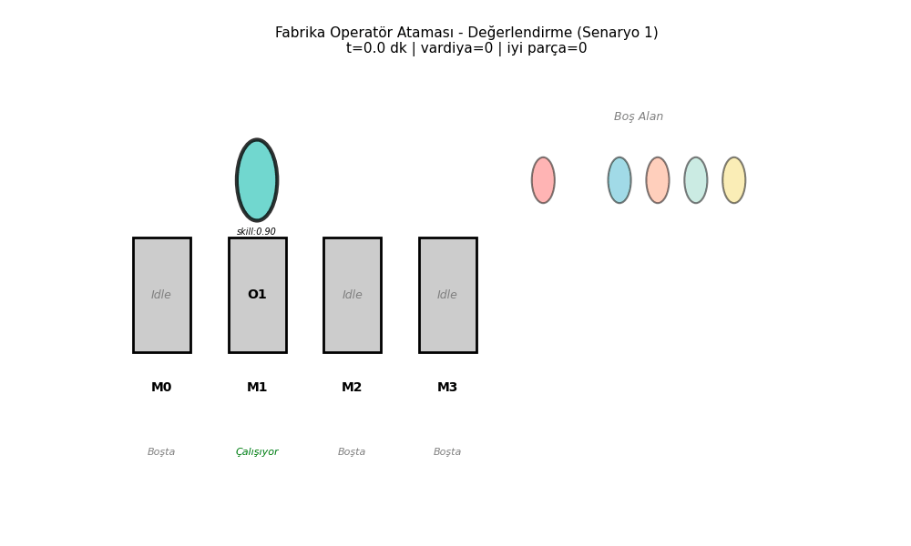
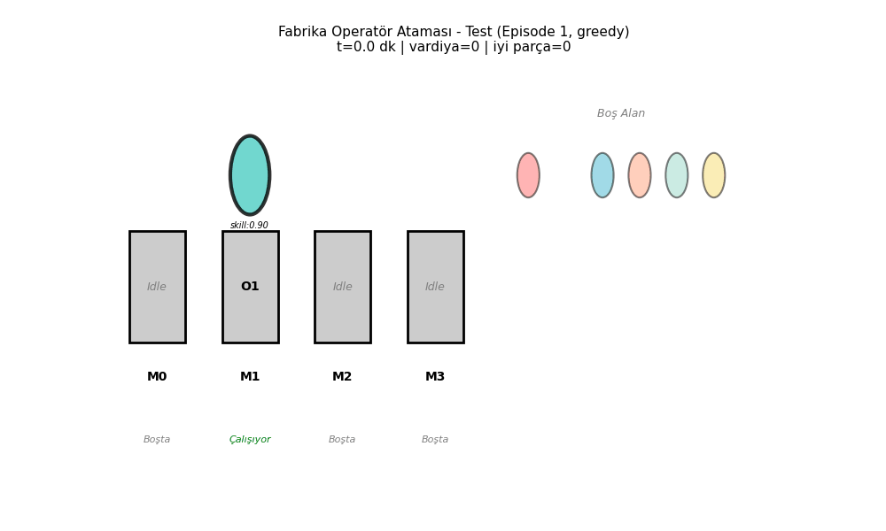
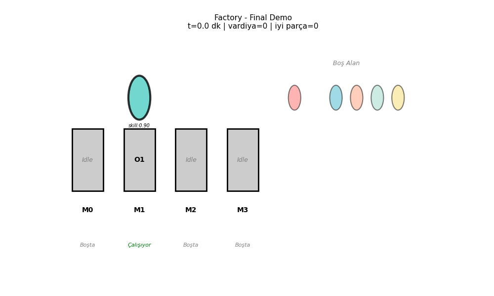
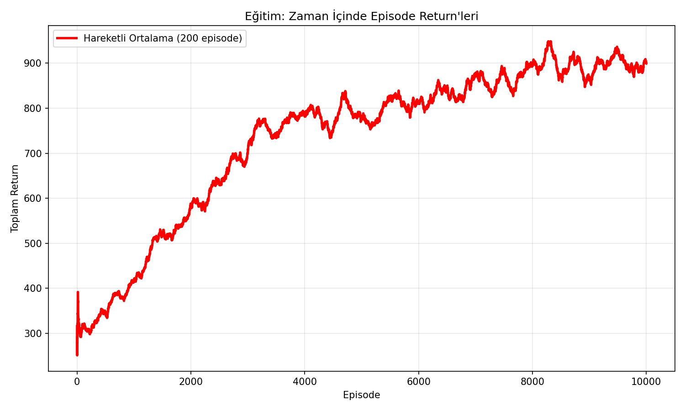
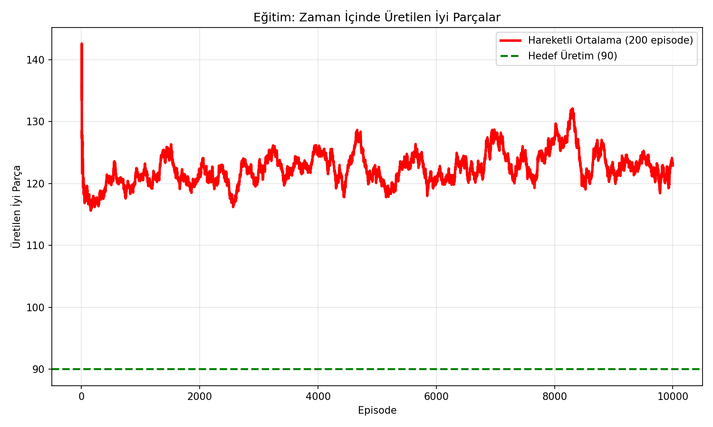

## 🏭 Dinamik Operatör Ataması – Q-Learning ile Küçük Bir Fabrika Oyunu

Bu proje, 4 makine ve 6 operatörlü küçük bir fabrika ortamında, operatör–makine
atamasını **tabular Q-learning** ile denemek için yazıldı. Amaç; hangi durumda
hangi operatörü hangi makineye verirsem uzun vadede daha çok sağlam parça üretirim,
onu ödül (reward) sinyaliyle ajanımıza yavaş yavaş öğretmek.

---

## State – Action – Reward (kısaca)

### State (Durum)

Her karar anında ajan şu bilgilerin ayrıklaştırılmış halini görüyor:

- **Mevcut makine ID**: Şu an atama bekleyen makine (0–3)
- **Makine önceliği**: 0 = düşük, 1 = orta, 2 = yüksek
- **Vardiya indeksi**: 0, 1, 2 (gün 3 vardiyadan oluşuyor)
- **Kalan süre kovası**: Günün bitimine kalan süre (0–3 arası kova)
- **Üretim açığı kovası**: Hedefe kalan parça miktarı (0–3 arası kova)
- **Operatör müsaitlikleri**: Her operatör için 0 = meşgul, 1 = boş
- **Operatör beceri kovaları**: Mevcut makine için her operatörün beceri seviyesi (düşük / orta / yüksek)
- **Makine durumları**: Her makine için idle / busy / broken / maintenance bilgisi

Bu bilgiler bir `tuple` içine konup Q-tablosunda **state anahtarı** olarak kullanılıyor.

### Action (Eylem)

Ajan her adımda tek bir karar veriyor:

- **0 … (num_operators − 1)**: İlgili operatörü şu anki boş makineye ata
- **num_operators**: Kimseyi atama, makine o adımda boş kalsın

Yani toplam eylem sayısı = **operatör sayısı + 1**.

### Reward (Ödül)

Tam sayılar `config/demo_config.py` içindeki `reward_params` sözlüğünde duruyor.
Burada sadece mantığı özetliyorum:

- **Pozitif ödüller**
  - Sağlam parça üretince +puan
  - Yüksek becerili operatörü uygun makineye atayınca ekstra +puan
  - Makine boş kalmadan hemen önce atama yapınca hafif +puan
  - Günlük üretim hedefini tutturunca veya belli yüzdelerini geçince bonus
- **Cezalar**
  - Makineyi boş bırakınca −puan
  - Uygunsuz eşleşme sonucu çok yavaş üretim olunca −puan
  - Hatalı / kusurlu ürün çıkınca yüksek −puan
  - Gün sonunda hedefin altında kalan her parça için ek −puan

Kısaca: **doğru kişiyi doğru makineye verip makineleri boşa bekletmeyen** politikalar zamanla
daha yüksek toplam ödül alıyor ve Q-tablosu bunu yansıtmaya başlıyor.

---

## Proje Yapısı (özet)

```text
dynamic_operator_qlearning/
├── env/                  # Fabrika ortamı (FactoryEnv)
├── agent/                # Q-learning ajanı
├── config/               # Senaryo ve parametreler
├── scripts/              # Eğitim / değerlendirme / test script’leri
├── utils/                # Grafik ve GIF yardımcıları
└── outputs/              # Eğitim grafikleri ve GIF çıktıları
```

En çok değiştirilen dosyalar genelde `env/factory_env.py`,
`agent/q_learning_agent.py` ve `scripts/main_train.py`.

---

## Nasıl Çalıştırılır?

Önce bağımlılıkları kurmak için proje kök dizininde:

```bash
pip install -r requirements.txt
```

Sonra PowerShell’de klasöre girip:

```powershell
cd C:\Users\MSI\Desktop\dynamic_operator_qlearning

# 1) Eğitimi başlat (Q-learning)
py -m scripts.main_train

# 2) Eğitilmiş politikayı basit şekilde değerlendir
py -m scripts.main_eval

# 3) Daha detaylı test ve istatistikler
py -m scripts.main_test
```

Eğitim bittiğinde Q-tablosu `q_table.pkl` ve `q_table.h5` olarak kaydedilir.
Grafikler ve GIF’ler `outputs/` klasörüne yazılır.

---

## GIF’ler ve Grafikler (kısaca)

Bu proje, öğrenme sürecini görmek için birkaç basit görsel üretiyor:

- **Eğitim GIF’i**  
    
  En yüksek ödülü alan eğitim bölümünün zaman içindeki akışını gösteriyor.

- **Değerlendirme GIF’i**  
    
  Eğitilmiş (greedy) politikanın 1 bölümde nasıl davrandığını gösteriyor.

- **Test GIF’i**  
    
  Ayrıntılı testte ilk bölümün operatör–makine hareketlerini özetliyor.

- **İsteğe bağlı final demo**  
    
  `scripts/create_gif.py` ile istenirse ek bir tanıtım animasyonu alınabiliyor.

Eğitim performansını görmek için de:

- **Returns grafiği**  
  

- **Productions grafiği**  
  

Bu iki grafik, ajan gerçekten bir şeyler öğrenmiş mi diye hızlıca bakmak için yeterli oluyor.

---

## Küçük Not

Kodlar, bir ders / yüksek lisans projesi havasında yazılmıştır.  
Yorum satırları ve değişken isimleri tamamen akademik değil; biraz “deneme–yanılma”
düşüncesiyle ve anlaşılır olsun diye seçilmiştir.


